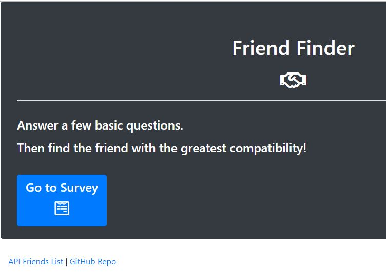
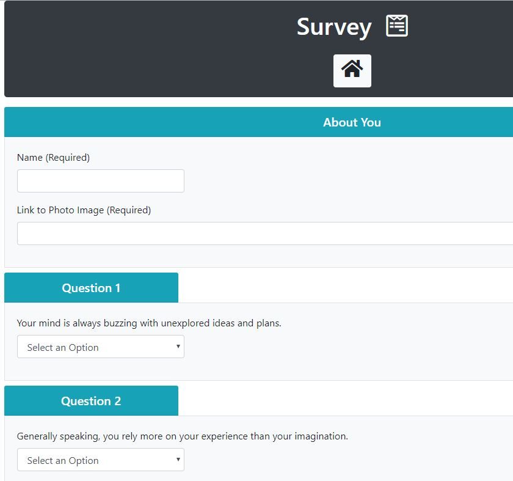
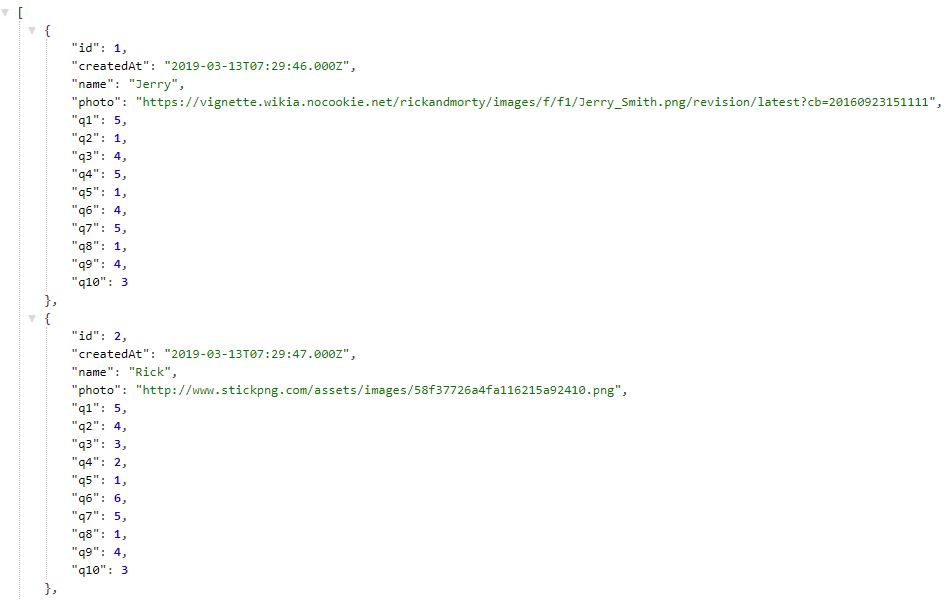
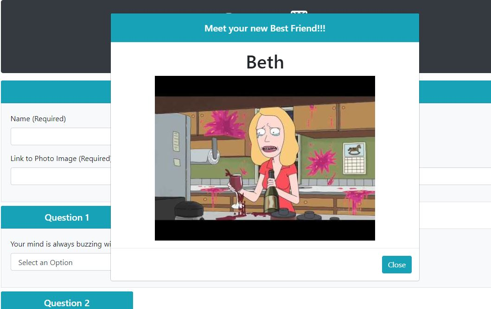

# FriendFinder
Friend Finder - Compatibility friend finder

## Deployed Application
https://fast-wildwood-31995.herokuapp.com/

## Instructions
* View all the the user object in the Database via the "API Friends List" Link
* Click the "Go to Survey" button to take a Survey the finds your BFF in the Friends List and then adds you to the Database for future compatibility matching

## Techonologies used
* Node
* Express
* MySQL
* HTML
* Bootstrap
* jQuery
* Heroku + JawsDB (for deploying MySQL on Heroku)

## Screenshots

## Contributors
* Steve Thompson (sthmpsn)
